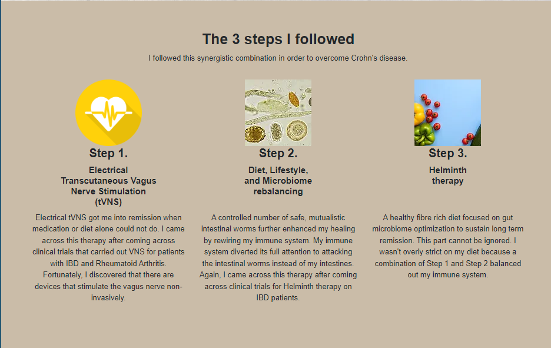
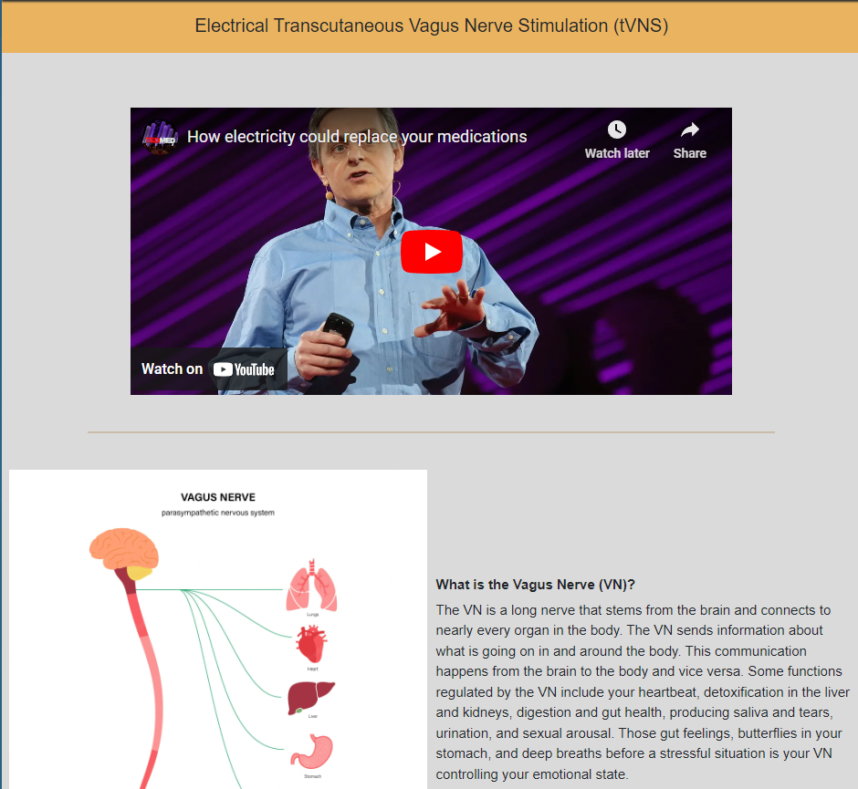

# MICROBIOME MADNESS 
This site is designed to give readers with Chron's disease information on different therapies
### Technologies used
HTML5, CSS

********************ADD CODE STRUCTURE*************************************

## User Experience (UX)

### User Stories

#### Visitor Goals
- Intro to who the author is and how they became 
- Find out more about how they can help themselves recover

## Design
### Colour Scheme
I decided to use neutral colours to keep the site an easy read.

#### Background Colours:
- rgb(49, 49, 49) (header and footer background)
- rgb(234, 179, 96) (background of slogan bar at top of pages)
- rgb(202, 188, 168) (text background)

#### Button Colours:
- rgb(218, 141, 0)

## Features
This website has 3 pages, a home page, a page with details of the author and a page with information about a therapy option

All pages are responsive and have the favicon:

### Favicon

### Navbar
A header and either the navigation options at the top or the hamburger menu (with responsive options):

### Landing Page

- The landing page is designed to be an easy read. A brief introduction and a soft picture.

!
- Three steps section
    -   This section gives more information into the steps taken by the author 
    -   Designed in three steps to break up the information and make it easy to digest

- Footer
    -   The footer contains a link to the book the author has written as well as a subscription section to the the newsletter

- About Me page
    -   The About Me page is designed to be simple and give more information on the author and the struggles they faced.

- Vagus Nerve Therapy page
    -   The final page is detailed information on the issues involved and what the therapy is

### Features left to implement
- More therapy suggestiong
- A blog
- Contact page
- Coaching page

## Testing

## Deployment
Visit the deployed site: <a href="https://gauravjagpal.github.io/codeinstitute-projects/">Microbiome Madness</a>