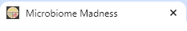
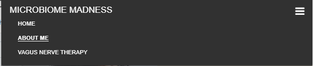
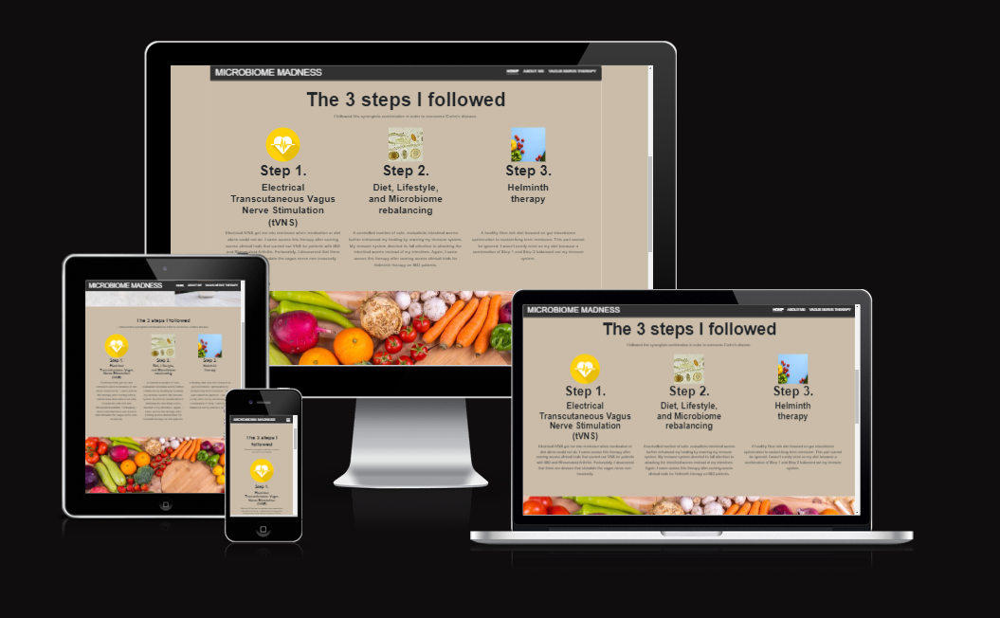

# MICROBIOME MADNESS 
Welcome to [Microbiome Madness!](https://gauravjagpal.github.io/codeinstitute-projects/)!

This site is designed to give individuals with Chron's disease a comprehensive resource on various therapeutic options.

Within this site, you will find a wealth of information spanning diverse therapeutic approaches aimed at addressing the unique challenges associated with Crohn's disease.

We understand that navigating the landscape of Crohn's disease management can be complex, and our aim is to simplify this process by offering clear, concise, and accessible information.

### Technologies used
HTML5, CSS

## CONTENTS

* [Code Structure](#code-structure)
    - HTML Files
    - Assets Folder
    - README File
    - Media Folder

* [User Experience (UX)](#user-experience-ux)
    - User Stories
        - Visitor Goals

* [Design](#design)
    - Colour Scheme
    - Background Colours
    - Button Colours

* [Features](#features)
    - Favicon
    - Navbar
    - Landing Page
    - Features left to implement

* [Testing](#testing)
    - Validator Testing
        - W3C validator
        - Jigsaw Validator
    
    - Lighthouse Testing
        - Index page
        - About page
        - Vagus Nerve page
        - Submission Page

    - Unfixed Bugs

* [Deployment](#deployment)

* [Credits](#credits)

## Code Structure
### HTML files
I have stored all of my HTML5 files at the directory level

### Assets folder
All files complimenting my HTML have been included in the assets folder. Broken down by:
- css
- favicons
- images

### README file
The README file is also at directory level and the assosciated files are stored in a "media" folder

### Media Folder
The Media folder contains all of the images used in the README file

## User Experience (UX)

### User Stories

#### Visitor Goals
- Intro to who the author is and how they became 
- Find out more about how they can help themselves recover

## Design
### Colour Scheme
I decided to use neutral colours to keep the site an easy read.

#### Background Colours:
- rgb(49, 49, 49) (header and footer background)
- rgb(234, 179, 96) (background of slogan bar at top of pages)
- rgb(202, 188, 168) (text background)

#### Button Colours:
- rgb(218, 141, 0)

## Wireframes

### Home page

### About me page 

### Vagus Nerve

## Features
This website has 3 pages, a home page, a page with details of the author and a page with information about a therapy option

All pages are responsive and have the favicon:

### Favicon

### Navbar
A header and either the navigation options at the top or the hamburger menu (with responsive options):

### Landing Page

- The landing page is designed to be an easy read. A brief introduction and a soft picture.

!
- Three steps section
    -   This section gives more information into the steps taken by the author 
    -   Designed in three steps to break up the information and make it easy to digest

- Footer
    -   The footer contains a link to the book the author has written as well as a subscription section to the the newsletter

- About Me page
    -   The About Me page is designed to be simple and give more information on the author and the struggles they faced.

- Vagus Nerve Therapy page
    -   The final page is detailed information on the issues involved and what the therapy is

### Features left to implement
- More therapy suggestions
- A blog
- Contact page
- Coaching page

## Testing
### Validator testing
#### W3C validator
The html files have been run through the <a href="https://validator.w3.org/#validate_by_input"> W3C </a>validator and the below are the current status:
- [index.html](index.html) - pass - No errors or warnings
- [about.html](about.html) - pass - No errors or warnings
- [vagus-nerve.html](vagus-nerve.html) - pass - No errors or warnings

#### Jigsaw validator
The CSS files have been run through the <a href="https://jigsaw.w3.org/css-validator/#validate_by_input">Jigsaw </a>validator and the below are the current status:
- style.css - pass - No error found

### Lighthouse testing
 - Index page
    - Desktop Testing:
    
    
    - Mobile Testing:
    

- About page
    - Desktop Testing:
    
    - Mobile Testing:
    

- Vagus Nerve page
    - Desktop Testing:
    
    - Mobile Testing:
    

- Subscription Page
    - Desktop Testing:
    
    - Mobile Testing:
    

## Bugs
- Images not loading on deployed site. I realised I was using absolute paths for images and changed this to relative paths.

### Unfixed Bugs
As of yet, I have not found any further bugs which still need fixing.

## Deployment & Local Development

### Deployment

The site is deployed using GitHub Pages - [Microbiome Madness](https://gauravjagpal.github.io/codeinstitute-projects/).

To Deploy the site using GitHub Pages:

1. Login (or signup) to Github.
2. Go to my repository for the project, [gauravjagpal/codeinsitute-projects](https://github.com/gauravjagpal/codeinstitute-projects).
3. Click the settings button in the banner near the top of the screen.
4. On the menu on the left hand side, select "Pages".
5. From the Branch dropdown select main branch and press save.
6. The site has now been deployed (this may take a few minutes to action).

### Local Development

#### How to Fork

To fork the repository:

1. Login (or signup) to Github.
2. Go to my repository for the project, [gauravjagpal/codeinsitute-projects](https://github.com/gauravjagpal/codeinstitute-projects).
3. Click the Fork button in the top right corner.

#### How to Clone

To clone the repository:

1. Login (or signup) to Github.
2. Go to my repository for the project, [gauravjagpal/codeinsitute-projects](https://github.com/gauravjagpal/codeinstitute-projects).
3. Click on the Green code button, choose whether you would like to clone with HTTPS, SSH or GitHub CLI and copy the link shown.
4. Launch the terminal within your code editor and set the current working directory to the desired location for the cloned directory.
5. Type 'git clone' into the terminal and then paste the link you copied in step 3. Press enter.

## Credits
- Sources I used to help me build this site include:
    - <a href="https://getbootstrap.com/">Bootstrap </a> for styling
    - <a href="https://www.wix.com/lpviral/enviral?utm_campaign=vir_wixad_live&adsVersion=white&orig_msid=7256104d-cd5f-41f7-a005-53b7c74e6f1d"> Wix</a> for images